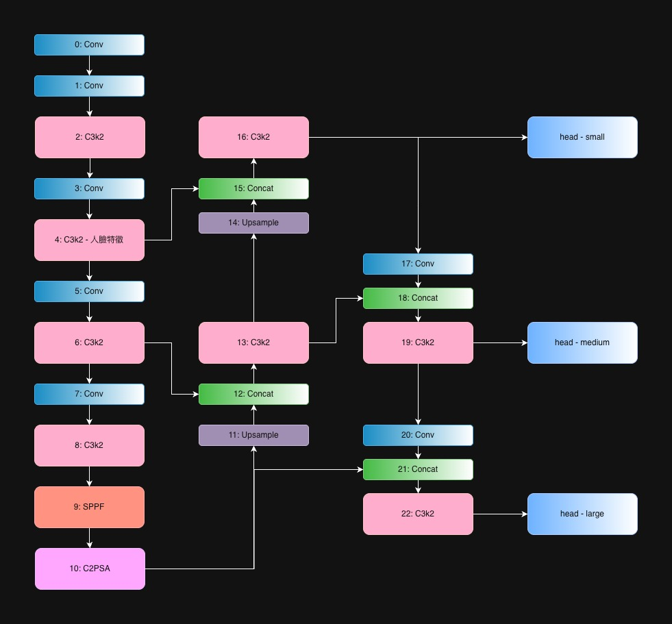

# YOLO Face Detection

## 環境設定

### 環境 1 (一般訓練)

```bash
# conda
conda create -n yolo python=3.10 -y
conda activate yolo

# 套件
pip install ultralytics
pip install torch torchvision torchaudio # 上面已包含安裝
pip install opencv-python # 上面已包含安裝
pip install tqdm # 進度條
pip install pytubefix # youtube
```

### 環境 2 (想要自訂 Block 用)

```bash
git clone https://github.com/ultralytics/ultralytics ultralytics_out
cd ultralytics_out
pip install -e . # 安裝依賴
ln -s ./ultralytics ../ultralytics # 拆一層
```

## 資料集

### 來源

http://shuoyang1213.me/WIDERFACE/index.html

### 資料夾結構

```md
dataset/
├── wider_face_split/
├── WIDER_train/
│ └── images/
├── WIDER_val/
│ └── images/
└── widerface/
```

### 張數比例

- WIDER_train: 12880
- WIDER_val: 3226
- WIDER_test: 16097

### 難度等級

- Easy: 大臉 + 清晰 + 無遮擋
- Medium: 臉中等 + 有遮擋或角度大
- Hard: 小臉 + 遮擋嚴重 + 角度極端 + 人多

### 參數分析

- face: 同張圖多少人臉
- blur: 人臉的模糊程度
- invalid: 難分辨的人臉
- occlusion: 遮擋程度 1%~30%

```json
{
  // train1 => yolo11.yaml
  "train1_4_5_6": {
    "count": 12876,
    "num": 159420,
    "num_used": 159393,
    "face_0": 4,
    "face_1": 11850,
    "face_2": 1026,
    "blur_0": 22795,
    "blur_1": 40811,
    "blur_2": 95818,
    "invalid_0": 157025,
    "invalid_1": 2399,
    "occlusion_0": 95864,
    "occlusion_1": 27830,
    "occlusion_2": 35730
  },
  // wh < 10, blur_0, invalid_0, occlusion_0, occlusion_1
  // train2 => train + val
  // train3 => train
  "train2_3": {
    "count": 7749,
    "num": 159420,
    "num_used": 19723,
    "face_0": 4,
    "face_1": 11850,
    "face_2": 1026,
    "blur_0": 19723,
    "blur_1": 0,
    "blur_2": 0,
    "invalid_0": 19723,
    "invalid_1": 0,
    "occlusion_0": 18559,
    "occlusion_1": 1164,
    "occlusion_2": 0
  }
}
```

## 訓練參數

- Image Size: 640/320/160
- Epoch: 100
- Batch Size: 16
- Optimizer: SGD
- Learning Rate: 0.01
- Momentum: 0.937
- Weight Decay: 0.0005
- device: cuda
- max_det: 300

## Metrics

- Precision (精確率): 不要錯
- Recall (召回率): 不要漏
- mAP50: (Mean Average Precision): IoU=0.5
- mAP50-95 (Mean Average Precision): IoU=0.50~0.95

## 結果 1 - Apple M1 Pro

- Ultralytics 8.3.231
- Python-3.10.19
- torch-2.9.0
- imgsz: 320
- device: mps
- max_det: 30 (92%)

| 編號   | 模型    | Epoch | BatchS | Precision | Recall  | mAp50   | mAP50-95 |
| ------ | ------- | ----- | ------ | --------- | ------- | ------- | -------- |
| paper  | yolo11  | 100   | 16     | 0.758     | 0.389   | 0.452   | 0.240    |
| train1 | yolo11  | 100   | 8      | 0.78238   | 0.33381 | 0.41842 | 0.23952  |
| train2 | yolo11  | 100   | 8      | 0.82613   | 0.75102 | 0.81848 | 0.56657  |
| train3 | yolo11  | 100   | 8      | 0.78388   | 0.25451 | 0.35721 | 0.20806  |
| train4 | yolo100 | 50    | 8      | 0.77317   | 0.32454 | 0.40654 | 0.22926  |
| train5 | yolo101 | 50    | 8      | 0.76898   | 0.32585 | 0.40759 | 0.23047  |
| train6 | yolo102 | 50    | 8      | 0.77886   | 0.3223  | 0.40447 | 0.22924  |
| train7 | yolo103 | 50    | 8      | X         | X       | X       | X        |
| train8 | yolo104 | 100   | 8      | 0.78677   | 0.33885 | 0.42258 | 0.24149  |

## 結果 2 - NVIDIA A100-SXM4-80GB, 81222MiB

- Ultralytics 8.3.233
- Python-3.12.12
- torch-2.9.0+cu126
- imgsz: 640
- device: cuda
- max_det: 300

| 編號   | 模型    | Epoch | BatchS | Precision | Recall  | mAp50   | mAP50-95 |
| ------ | ------- | ----- | ------ | --------- | ------- | ------- | -------- |
| paper  | yolo11  | 100   | 16     | 0.854     | 0.587   | 0.673   | 0.371    |
| colab1 | yolo11  | 100   | 16     | 0.84398   | 0.57129 | 0.65477 | 0.35863  |
| colab2 | yolo104 | 100   | 16     | 0.83975   | 0.57361 | 0.65365 | 0.35858  |
| colab3 | yolo103 | 92    | 16     | 0.85249   | 0.61788 | 0.70433 | 0.39063  |

```
YOLO11n summary: 181 layers, 2,624,080 parameters, 2,624,064 gradients, 6.6 GFLOPs
YOLO100n summary: 181 layers, 2,362,323 parameters, 2,362,307 gradients, 6.5 GFLOPs
YOLO101n summary: 136 layers, 1,625,426 parameters, 1,625,410 gradients, 6.0 GFLOPs (61.94%)
YOLO102n summary: 154 layers, 1,873,106 parameters, 1,873,090 gradients, 6.1 GFLOPs (71.38%)
YOLO103n summary: 205 layers, 2,576,292 parameters, 2,576,276 gradients, 13.7 GFLOPs
YOLO104n summary: 146 layers, 1,622,674 parameters, 1,622,658 gradients, 5.9 GFLOPs (61.83%)
```

## 調整方向



> YOLO100 (train4)

- 去除 C2PSA
- 在 i16 之後, 增加 C3k2 x 2 + True (增強小物件特徵)

> YOLO101 (train5)

- 去除 C2PSA
- 直接加強 i4, C3k2 2 => 4
- 直接加強 i16, C3k2 2 => 4
- 去除 P5 head (對大物件處理)

> YOLO102 (train6)

- 直接加強 i16, C3k2 2 => 6
- 去除 P5 head (對大物件處理)

> YOLO103 (train7)

- 在 i16 之後, 直接增加一層處理 extra-small
- 增加 P2 head (對小物件處理)

> YOLO104 (train8)

- 去除 C2PSA
- 在 i16 之後, 增加 C3k2 x 2 + True (增強小物件特徵)
- 去除 P5 head (對大物件處理)

## 參照論文

1. [WIDER FACE: A Face Detection Benchmark](https://arxiv.org/pdf/1511.06523)

- 資料集來源

2. [以資料擴增方法優化之卷積神經網路人臉偵測系統](https://tdr.lib.ntu.edu.tw/retrieve/c3795528-0fcb-44bc-a96a-49226ee65669/ntu-113-2.pdf)

- 人臉擴增方式
- 精度剪枝
- 通道剪枝
- 精度轉換

3. [The Impact of Image Resolution on Face Detection: A Comparative Analysis of MTCNN, YOLOv XI and YOLOv XII models](https://www.arxiv.org/pdf/2507.23341)

- 不同解析度下的比較
- 以這邊參數當使用依據

4. [YOLOV11: AN OVERVIEW OF THE KEY ARCHITECTURAL ENHANCEMENTS](https://arxiv.org/pdf/2410.17725)

- 主要看 code

5. [YOLOv13: Real-Time Object Detection with Hypergraph-Enhanced Adaptive Visual Perception](https://arxiv.org/pdf/2506.17733)

- YOLO13 架構圖

6. [Evaluating the Evolution of YOLO (You Only Look Once) Models: A Comprehensive Benchmark Study of YOLO11 and Its Predecessors](https://arxiv.org/pdf/2411.00201v1)

- 用來比較各個階段的 YOLO 架構圖

7. [RetinaFace: Single-stage Dense Face Localisation in the Wild](https://arxiv.org/pdf/1905.00641)

- 臉部五點定位
- 或許可以當成 yolo-pose 訓練方式, 增加人臉辨識能力

8. [YOLO5Face: Why Reinventing a Face Detector](https://arxiv.org/pdf/2105.12931)

- YOLOv5 + CSPNet or ShuffleNetV2 (原本前者, 輕量時用後者)

9. [YOLO-FaceV2: A Scale and Occlusion Aware Face Detector](https://arxiv.org/pdf/2208.02019)

- YOLOv5 + CSPDarknet53
