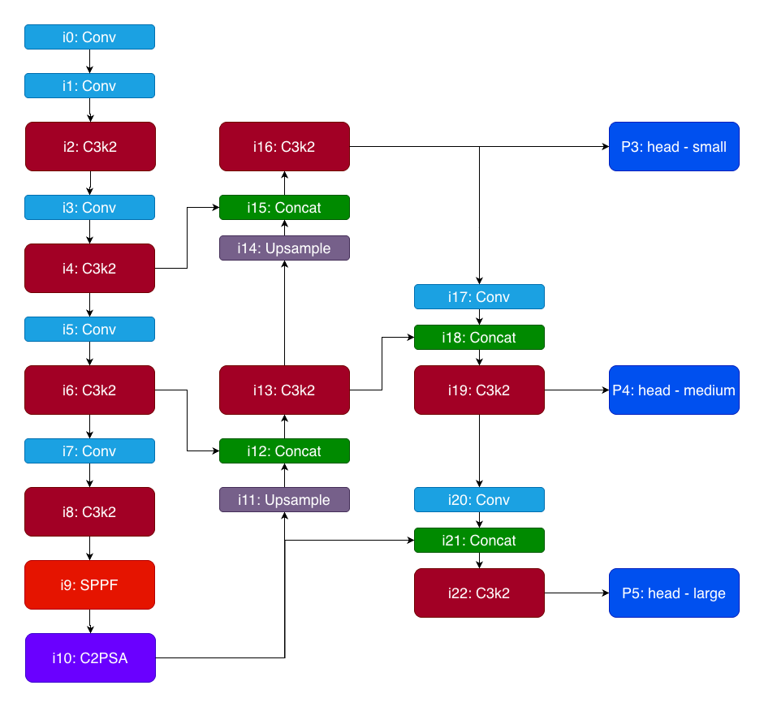

# YOLO Face Detection

## 環境設定

### 環境 1 (一般訓練)

```bash
# conda
conda create -n yolo python=3.10 -y
conda activate yolo

# 套件
pip install ultralytics
pip install torch torchvision torchaudio # 上面已包含安裝
pip install opencv-python # 上面已包含安裝
pip install tqdm # 進度條
pip install pytubefix # youtube
```

### 環境 2 (想要自訂 Block 用)

```bash
git clone https://github.com/ultralytics/ultralytics ultralytics_out
cd ultralytics_out
pip install -e . # 安裝依賴
ln -s ./ultralytics ../ultralytics # 拆一層
```

## 資料集

### 來源

http://shuoyang1213.me/WIDERFACE/index.html

### 資料夾結構

```md
dataset/
│
├── wider_face_split/
│ └── readme.txt
│ └── wider_face_train_bbx_gt.txt
│ └── wider_face_val_bbx_gt.txt
│
├── WIDER_train/
│ └── images/
│
├── WIDER_val/
│ └── images/
│
├── widerface/
│ └── 資料整理後位置
│
```

### 使用方式

```sh
python parse.py
```

### 結果如下

```json
{
  "count": 12876, // 圖片張數
  "num": 159420, // 人臉數
  "num_used": 159393, // 過濾後的人臉數
  "face_0": 4, // 該圖 0 臉
  "face_1": 11850, // 該圖 1-30 臉
  "face_2": 1026, // 該圖 30- 臉
  "blur_0": 22795, // 人臉的模糊程度
  "blur_1": 40811,
  "blur_2": 95818,
  "invalid_0": 157025, // 人臉的分辨度
  "invalid_1": 2399,
  "occlusion_0": 95864, // 人臉的遮擋程度
  "occlusion_1": 27830,
  "occlusion_2": 35730
}
```

### 論文高品質參數定義結果如下

```json
{
  "count": 7749,
  "num": 159420,
  "num_used": 19723,
  "face_0": 4,
  "face_1": 11850,
  "face_2": 1026,
  "blur_0": 19723,
  "blur_1": 0,
  "blur_2": 0,
  "invalid_0": 19723,
  "invalid_1": 0,
  "occlusion_0": 18559,
  "occlusion_1": 1164,
  "occlusion_2": 0
}
```

## 模型訓練

### 使用方式

```sh
python train.py
```

### 環境1 - Apple M1 Pro

- Ultralytics 8.3.231
- Python-3.10.19
- torch-2.9.0
- device: mps

### 環境2 - NVIDIA A100-SXM4-80GB, 81222MiB

- Ultralytics 8.3.233
- Python-3.12.12
- torch-2.9.0+cu126
- device: cuda

### 訓練參數

- Image Size: 640/320
- Epoch: 100/50
- Batch Size: 16/8
- Optimizer: SGD
- Learning Rate: 0.01
- Momentum: 0.937
- Weight Decay: 0.0005
- device: cuda/mps
- max_det: 300/30

### Metrics 解讀

- Precision (精確率): 不要錯
- Recall (召回率): 不要漏
- mAP50: (Mean Average Precision): IoU=0.5
- mAP50-95 (Mean Average Precision): IoU=0.50~0.95

### 結果如下

| 編號    | 模型    | 環境  | imgsz | Precision | Recall  | mAp50   | mAP50-95 |
| ------- | ------- | ----- | ----- | --------- | ------- | ------- | -------- |
| train1  | yolo11  | 環境1 | 320   | 0.78238   | 0.33381 | 0.41842 | 0.23952  |
| train2  | yolo11  | 環境1 | 320   | 0.82613   | 0.75102 | 0.81848 | 0.56657  |
| train3  | yolo11  | 環境1 | 320   | 0.78388   | 0.25451 | 0.35721 | 0.20806  |
| train4  | yolo100 | 環境1 | 320   | 0.77317   | 0.32454 | 0.40654 | 0.22926  |
| train5  | yolo101 | 環境1 | 320   | 0.76898   | 0.32585 | 0.40759 | 0.23047  |
| train6  | yolo102 | 環境1 | 320   | 0.77886   | 0.3223  | 0.40447 | 0.22924  |
| train7  | yolo103 | 環境1 | 320   | 0.81262   | 0.37014 | 0.45827 | 0.26646  |
| train8  | yolo104 | 環境1 | 320   | 0.78677   | 0.33885 | 0.42258 | 0.24149  |
| train9  | yolo11  | 環境2 | 640   | 0.84398   | 0.57129 | 0.65477 | 0.35863  |
| train10 | yolo103 | 環境2 | 640   | 0.85402   | 0.61802 | 0.70428 | 0.39068  |
| train11 | yolo104 | 環境2 | 640   | 0.83975   | 0.57361 | 0.65365 | 0.35858  |

### 模型差異

```sh
python info.py
```

```
YOLO11n summary: 181 layers, 2,624,080 parameters, 2,624,064 gradients, 6.6 GFLOPs
YOLO100n summary: 181 layers, 2,362,323 parameters, 2,362,307 gradients, 6.5 GFLOPs
YOLO101n summary: 136 layers, 1,625,426 parameters, 1,625,410 gradients, 6.0 GFLOPs
YOLO102n summary: 154 layers, 1,873,106 parameters, 1,873,090 gradients, 6.1 GFLOPs
YOLO103n summary: 205 layers, 2,576,292 parameters, 2,576,276 gradients, 13.7 GFLOPs
YOLO104n summary: 146 layers, 1,622,674 parameters, 1,622,658 gradients, 5.9 GFLOPs
```

### 調整方向



> YOLO100

- 去除 C2PSA
- 保留 P5 head
- 在 i16 之後, 增加 C3k2 x 2 + True (增強小物件特徵)

> YOLO101

- 去除 C2PSA
- 去除 P5 head
- 直接加強 i4, C3k2 2 => 4
- 直接加強 i16, C3k2 2 => 4

> YOLO102

- 保留 C2PSA
- 去除 P5 head
- 直接加強 i16, C3k2 2 => 6

> YOLO103

- 保留 C2PSA
- 保留 P5 head
- 在 i16 之後, 直接增加一層處理 extra-small
- 增加 P2 head (對小物件處理)

> YOLO104

- 去除 C2PSA
- 去除 P5 head
- 在 i16 之後, 增加 C3k2 x 2 + True (增強小物件特徵)

## 模型應用

### 使用方式

```sh
# w 暫停
# q 退出

python detect.py
```

使用本機鏡頭

> INPUT = 0

使用本機影片

> INPUT = './dataset/video/video.mp4'

使用 Youtube 影片

> INPUT = 'https://www.youtube.com/watch?v=_CrTi1aNJ-E'

使用台中市即時交通資訊網

1. 網址：https://e-traffic.taichung.gov.tw/ATIS_TCC/
2. 右邊點選即時影像
3. 選擇攝影機
4. 取得影像 stream url

> INPUT = 'https://tcnvr3.taichung.gov.tw/c3c46934'
